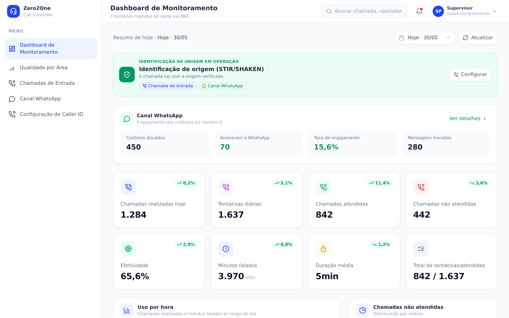
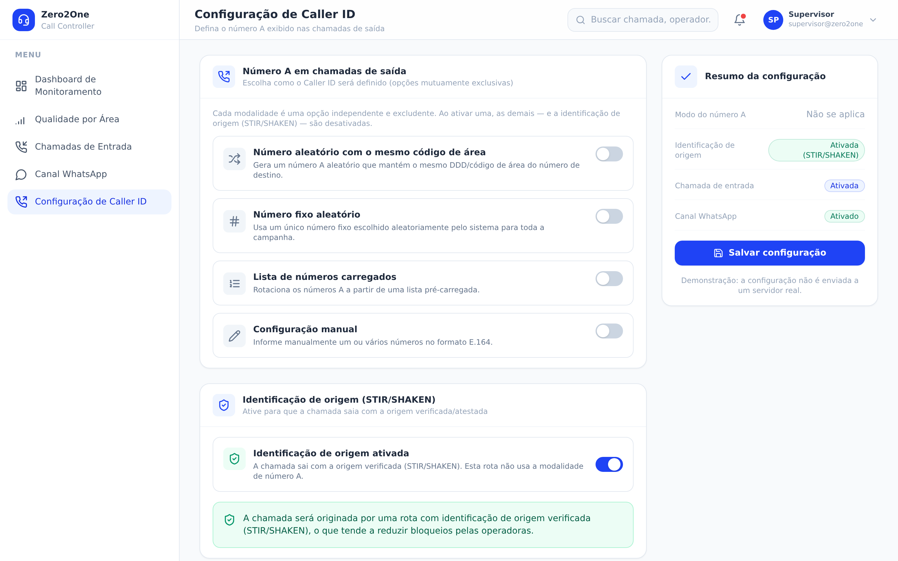
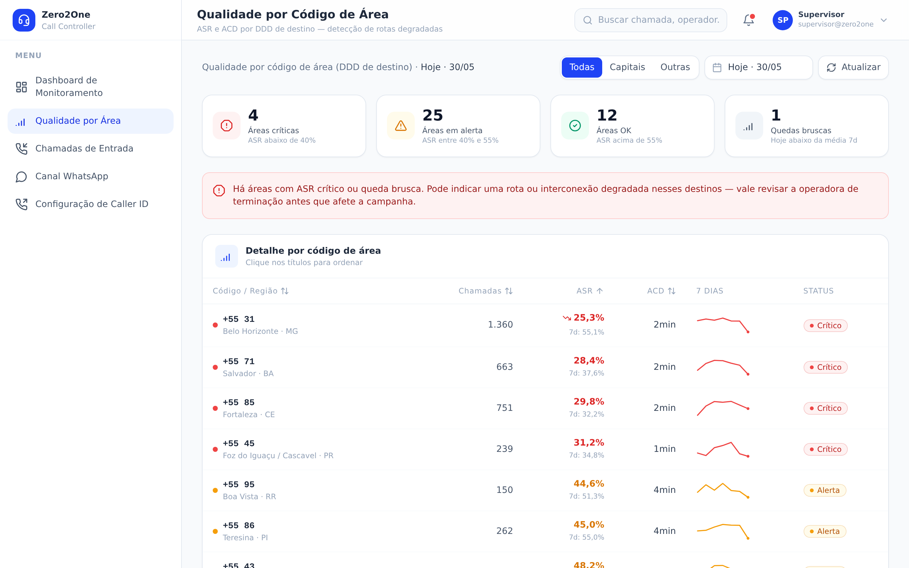
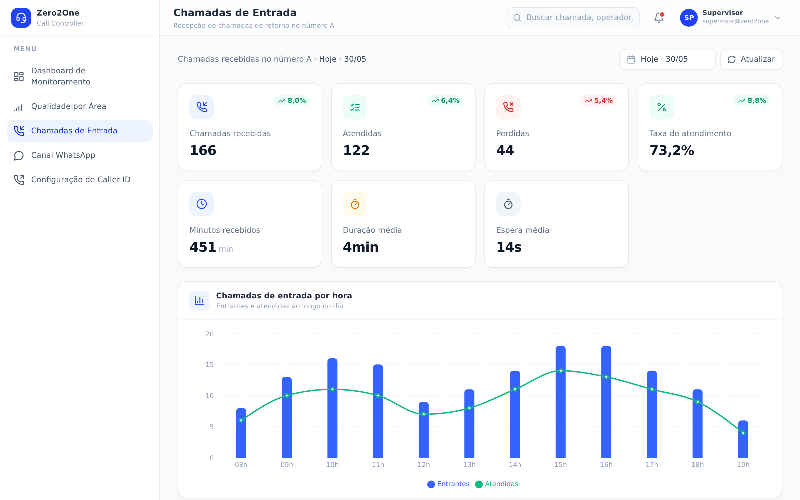
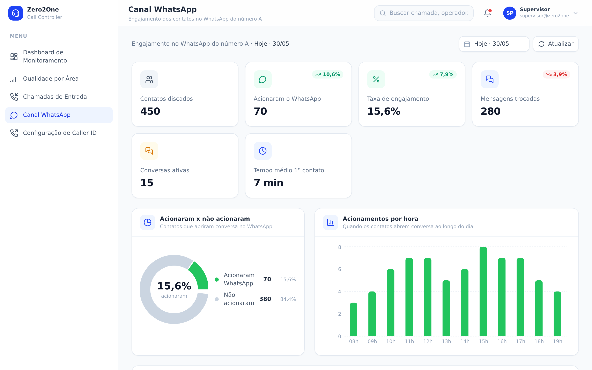

# Zero2One · CallerController

> Plataforma de monitoramento e operação inteligente de chamadas manuais de saída para contact centers.

[](https://react.dev)
[](https://vitejs.dev)
[](https://tailwindcss.com)
[]()
[](./LICENSE)

O **CallerController** maximiza a taxa de contato efetivo de campanhas de discagem manual por meio de estratégias inteligentes de Caller ID (ANI), identificação de origem verificada (STIR/SHAKEN), canais complementares (chamadas de entrada e WhatsApp) e analítica em tempo real.

Esta é a **interface (frontend)** do produto. Atualmente opera com **dados mock realistas** e está arquitetada para conexão com o backend/API real sem alterações nas telas.

> ℹ️ Os dados exibidos são fictícios. Não há backend, banco de dados nem autenticação nesta fase.

---

## Sumário

- [Telas](#telas)
- [Funcionalidades](#funcionalidades)
- [Stack](#stack)
- [Como rodar](#como-rodar)
- [Scripts](#scripts)
- [Estrutura do projeto](#estrutura-do-projeto)
- [Integração futura com a API](#integração-futura-com-a-api)
- [Documentação](#documentação)
- [Roadmap](#roadmap)
- [Licença](#licença)

---

## Telas

### Dashboard de Monitoramento


### Configuração de Caller ID


### Qualidade por Código de Área


### Chamadas de Entrada


### Canal WhatsApp


---

## Funcionalidades

- **Dashboard de monitoramento** — KPIs do dia (chamadas, tentativas, atendidas, efetividade, minutos, ACD), gráfico de uso por hora, distribuição de não atendidas e tabela de chamadas recentes. Filtro de data (últimos 14 dias).
- **Sinalização de operação** — banner que indica a modalidade de número A em operação e os recursos complementares ativos.
- **Configuração de Caller ID** — modalidades mutuamente excludentes via switch: número aleatório com mesmo DDD, número fixo aleatório, lista de números carregados e configuração manual (E.164 com validação).
- **Identificação de origem (STIR/SHAKEN)** — rota com origem verificada para reduzir bloqueios.
- **Estatísticas por opção de Caller ID** — comparativo de ASR e ACD com histórico de 30 dias.
- **Qualidade por código de área** — ASR/ACD por DDD (capitais de estado + demais), com semáforo de alerta e detecção de quedas bruscas para identificar rotas degradadas.
- **Chamadas de entrada** — recepção de retornos (modalidades fixo aleatório / STIR), com KPIs, gráfico por hora e últimas 50 chamadas.
- **Canal WhatsApp** — visibilidade do engajamento (acionaram vs. não acionaram), por hora e conversas recentes.
- **Responsivo** — layout adaptável (tabelas viram cards no mobile).

---

## Stack

| Camada | Tecnologia |
|--------|------------|
| UI | React 18 + Vite 5 |
| Estilo | TailwindCSS 3 |
| Gráficos | Recharts |
| Ícones | lucide-react |
| Rotas | react-router-dom 6 |

---

## Como rodar

Requisitos: **Node.js 20+** (ver `.nvmrc`).

```bash
# 1. Instalar dependências
npm install

# 2. (Opcional) Configurar variáveis de ambiente
cp .env.example .env.local

# 3. Ambiente de desenvolvimento
npm run dev      # http://localhost:5173

# 4. Build de produção
npm run build
npm run preview
```

---

## Scripts

| Script | Descrição |
|--------|-----------|
| `npm run dev` | Servidor de desenvolvimento (HMR). |
| `npm run build` | Build de produção em `dist/`. |
| `npm run preview` | Serve o build de produção localmente. |

---

## Estrutura do projeto

```
src/
├── App.jsx                  # Layout (sidebar + header) e rotas
├── main.jsx                 # Bootstrap React + Router
├── index.css                # Tailwind + estilos globais
├── context/
│   └── CallerIdContext.jsx  # Estado global da configuração de Caller ID
├── data/
│   └── mockData.js          # Dados fictícios + geradores determinísticos
├── services/
│   └── api.js               # Camada de acesso a dados (mock → API real)
├── lib/
│   └── format.js            # Formatação (pt-BR)
├── components/
│   ├── layout/              # Sidebar, Header
│   ├── ui/                  # Card, Badge, Switch, Spinner, Sparkline
│   ├── dashboard/           # KpiCard, gráficos, tabela de chamadas
│   ├── quality/             # Tabela de qualidade por área
│   ├── inbound/             # Componentes de chamadas de entrada
│   └── whatsapp/            # Componentes do canal WhatsApp
└── pages/
    ├── Dashboard.jsx
    ├── QualityByArea.jsx
    ├── InboundCalls.jsx
    ├── WhatsAppChannel.jsx
    └── CallerIdConfig.jsx
```

---

## Integração futura com a API

Toda leitura/escrita de dados passa por [`src/services/api.js`](src/services/api.js). Hoje as funções retornam os dados de `mockData.js` como `Promise` (com latência simulada). Para conectar o backend, basta trocar o corpo de cada função por um `fetch()` que respeite os mesmos formatos — **as telas não mudam**.

Cada função traz um comentário `// FUTURO:` com o endpoint sugerido. O contrato completo está em [`docs/API.md`](docs/API.md) e a visão de arquitetura em [`docs/ARQUITETURA.md`](docs/ARQUITETURA.md).

---

## Documentação

- [`CHANGELOG.md`](CHANGELOG.md) — histórico de versões.
- [`CONTRIBUTING.md`](CONTRIBUTING.md) — guia de contribuição e convenções.
- [`docs/ARQUITETURA.md`](docs/ARQUITETURA.md) — arquitetura e fluxo de dados.
- [`docs/API.md`](docs/API.md) — contrato de API para integração.
- `CallerController_PT.pdf` / `CallerController.pdf` — documento técnico-comercial.

---

## Roadmap

- [ ] Conexão com backend/API de telefonia (toggle `VITE_USE_MOCK`).
- [ ] Autenticação e perfis (operador / supervisor).
- [ ] Filtros avançados e exportação (CSV/Excel) nas tabelas.
- [ ] Atualização em tempo real (WebSocket/SSE).
- [ ] Testes automatizados (unitários e e2e).

---

## Licença

Proprietary © Zero2One. Ver [`LICENSE`](LICENSE).
